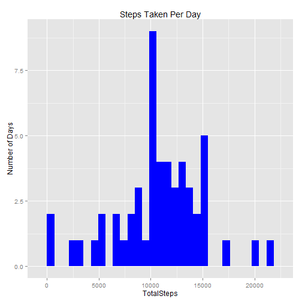
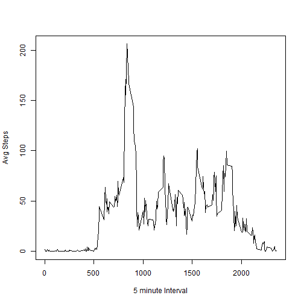
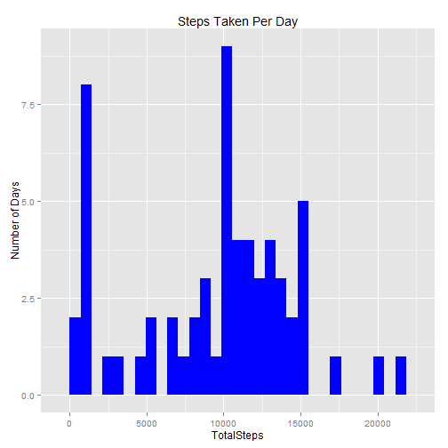
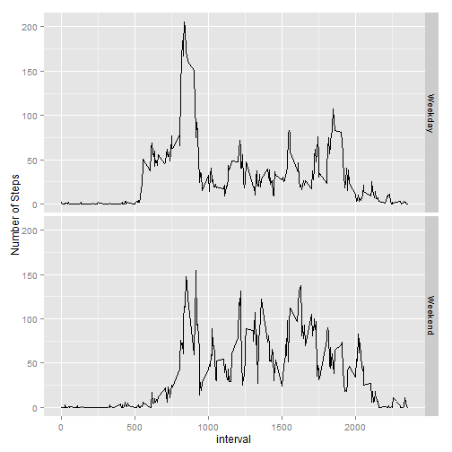

###Loading and preprocessing the data


######Creates Directory if doesn't Exist


```r
if(!file.exists("./Activities")) {dir.create("./Activities")}
```

######Sets Vector to Wearables


```r
dir <- "wearables"
```
######Downloads DataSet and Unzips


```r
fileurl <- "https://d396qusza40orc.cloudfront.net/repdata%2Fdata%2Factivity.zip"
download.file(fileurl,destfile="Activities\\ActivitiesData.zip")
unzip("Activities\\ActivitiesData.zip", list = FALSE,exdir="Activities", overwrite = TRUE)
```


######Read Files into vector


```r
Activities <- read.csv(file="activity.csv",header=TRUE, sep=,)
```


######Remove Missing Values & Zero Values


```r
Activities <- na.omit(Activities)
```

######Converts date to Date format and merges into vector


```r
Activities$date <- as.Date(Activities$date, format = "%Y-%m-%d")
```

###Calculate the total number of steps taken per day


```
## Source: local data frame [1 x 1]
## 
##   TotalSteps
## 1     570608
```


###Make a histogram of the total number of steps taken each day


```
## stat_bin: binwidth defaulted to range/30. Use 'binwidth = x' to adjust this.
```

 
    
###Calculate and report the mean and median of the total number of steps taken per day


```
## Source: local data frame [1 x 2]
## 
##       mean median
## 1 10766.19  10765
```


###What is the average daily activity pattern?

 

###Which 5-minute interval, on average across all the days in the dataset, contains the maximum number of steps?


```r
istepm <- sqldf("select interval, avgsteps Steps from istep order by avgsteps desc")
head(istepm, 1)
```

```
##   interval    Steps
## 1      835 206.1698
```

###Imputing missing values


```r
Activities2 <- read.csv(file="activity.csv",header=TRUE, sep=,)
```


###Calculate and report the total number of missing values in the dataset (i.e. the total number of rows with NAs)


```
## [1] 2304
```

    Devise a strategy for filling in all of the missing values in the dataset. The strategy does not need to be sophisticated.

    This finds the mean and median for each interval.


```r
m <- summarise(group_by(Activities, interval),mean=mean(steps), median=median(steps) )
```

    Create a new dataset that is equal to the original dataset but with the missing data filled in.


```r
f <- sqldf("Select a.date, a.interval, CASE WHEN a.steps is null THEN m.median ELSE a.steps END steps
          from Activities2 a Left Outer Join m on a.interval = m.interval ")
```

###Make a histogram of the total number of steps taken each day


```
## stat_bin: binwidth defaulted to range/30. Use 'binwidth = x' to adjust this.
```

 

    Mean and Median After NA Replacement


```r
summarise(bstep,mean=mean(TotalSteps), median=median(TotalSteps) )
```

```
## Source: local data frame [1 x 2]
## 
##       mean median
## 1 9503.869  10395
```

    Mean and Median Before NA Replacement
    
    Yes the mean decreased, but the median increased

```r
summarise(astep,mean=mean(TotalSteps), median=median(TotalSteps) )
```

```
## Source: local data frame [1 x 2]
## 
##       mean median
## 1 10766.19  10765
```
    The mean decreased, but the median increased

###Are there differences in activity patterns between weekdays and weekends?

    Create a new factor variable in the dataset with two levels - "weekday" and "weekend" indicating whether a given date is a weekday or                                 weekend day.


```r
f$date <- as.Date(f$date, format = "%Y-%m-%d")
f$weekday <- weekdays(f$date)
f$weekendflag <- isWeekend(f$date)
f$weekendflag[f$weekendflag == "TRUE"] <- "Weekend"
f$weekendflag[f$weekendflag == "FALSE"] <- "Weekday"
```

    Make a panel plot containing a time series plot (i.e. type = "l") of the 5-minute interval (x-axis) and 
    the average number of steps taken, averaged across all weekday days or weekend days (y-axis). 

 


